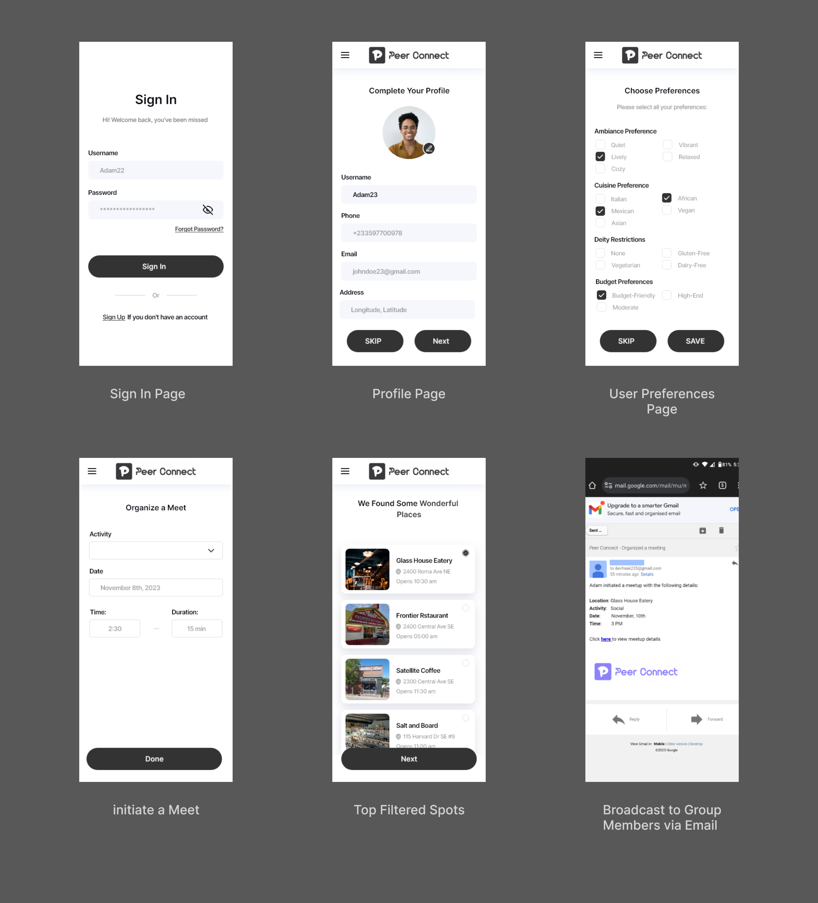
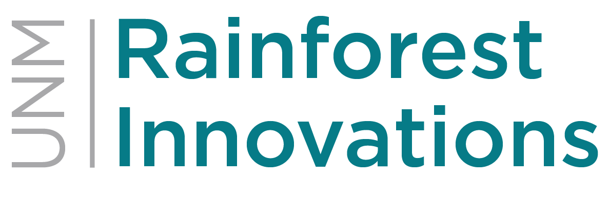
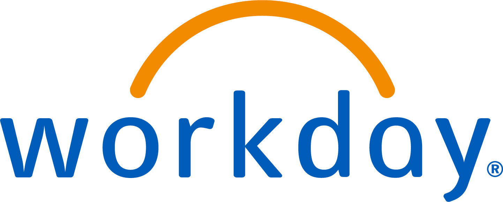

# Project Documentation for Peer Connect

### Description of the App
**Peer Connect**; an innovative application designed to facilitate easy meet-ups within groups. It calculates an optimal location for meetings based on member locations and preferences, and integrates with various APIs to enhance user experience.

### Developer/Team Bios
Adam Abusang: Full stack web developer with expertise in Flask and front-end development. Passionate about creating intuitive user experiences and business oriented applications.

### Technical Components
- Front-End: HTML, CSS, JavaScript, Bootstrap
- Back-End: Python, Flask
- Database: SQLite
- APIs Used: Google Places API for fetching nearby locations
- Libraries: Jinja2 for templating, SQLAlchemy for ORM
- Third-Party Services: Google Maps for map-related functionalities

### Audience Identification and User Stories
Our target audience includes but is not limited to:

- Social groups looking for meeting locations
- Event planners coordinating meet-ups
- Users planning informal gatherings

### Security and Responsibility
- Authentication system to protect user data
- Input validation to prevent SQL injection and XSS attacks
- Encrypted communication via HTTPS

### Design Plan and User Flows
prototype and High fidelity designs are available here: [Link to Adobe XD](https://xd.adobe.com/view/195e26ca-f45c-46eb-a256-67380c655524-4c0d/)

### Extras
Integrated with open data source: [Google Places API](https://developers.google.com/maps/documentation/places/web-service/overview)

### Screenshots

Please find the prototype here: [prototype](https://xd.adobe.com/view/195e26ca-f45c-46eb-a256-67380c655524-4c0d/)

### How to Run the Project
Detailed instructions on how to set up and run the project locally are provided in the [INSTALL.md](INSTALL.md) file within the repository

------
### Contest Sponsors
 

 
 